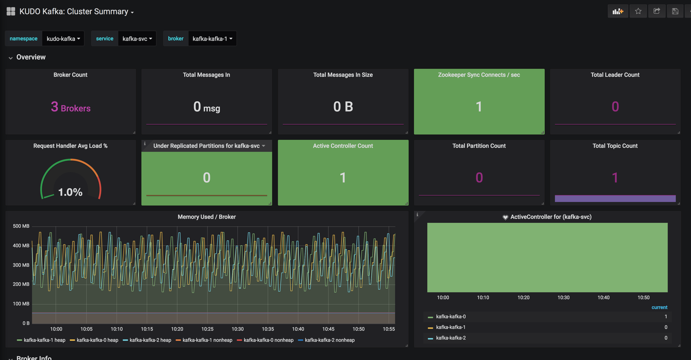

# KUDO Kafka Cluster runbook  


This document is to create a KUDO Kafka cluster and run a dummy workload on the created KUDO Kafka cluster


### Pre-requisites

- Kubernetes Cluster up & running
- Configured kubeconfig with kubectl in the path 
- Installed the KUDO cli with same version as the KUDO deployment


### Clone the repo

```
git clone git@github.com:zmalik/kudo-kafka-demo.git
cd kudo-kafka-demo
```

### Install the KUDO

Skip this step if KUDO is already installed

```bash
CONTROLLER_VERSION=0.5.0 scripts/install-kudo.sh
```

### Install the Operator/OperatorVersion for KUDO Kafka (with instance)

```bash
KUDO_KAFKA_VERSION=0.2.0 scripts/install-kafka-operator.sh
```

### Install the service-monitor

```bash
kubectl apply -f resources/service-monitor.yml -n kudo-kafka
```

### Install the grafana dashboard

Install the `https://github.com/kudobuilder/operators/blob/master/repository/kafka/docs/v0.1/resources/grafana-dashboard.json` to the Grafana to get access to kafka cluster overview.

After installing the dashboard. The dashboard should appear in the dashboards list as `KUDO Kafka: Custer Summary`  


And the dashboard with a preview of the cluster activity:



## Load testing

### Start the load testing 

```bash
kubectl apply -f resources/load-tests.yml -n kudo-kafka
```

### Scaling the load tests

We can scale horizontally the load tests by increasing or decreasing the number of replicas

```bash
kubectl scale deployment kafka-cluster-consumer-tests --replicas=1 -n kudo-kafka
```

```bash
kubectl scale deployment kafka-cluster-producer-tests --replicas=1 -n kudo-kafka
```

### Tear down the resources

With the next commands we can cleanup all objects we created for kafka test and also cleanup any running workload.

```
KUDO_KAFKA_VERSION=0.2.0 scripts/uninstall-kafka-operator.sh
CONTROLLER_VERSION=0.5.0 scripts/uninstall-kudo.sh
```


